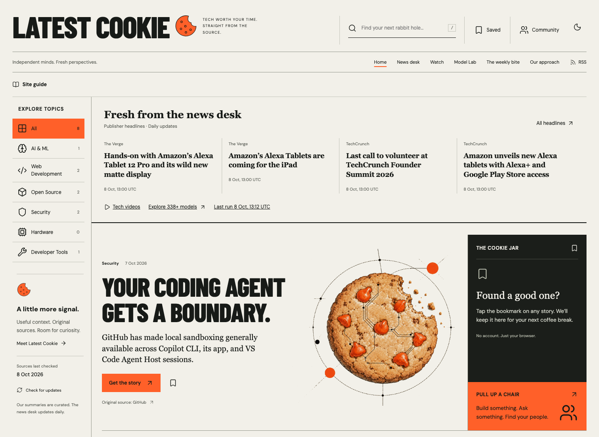

<div align="center">
  
  <h1>Latest Cookie</h1>
  <p><strong>Tech worth your time. Straight from the source.</strong></p>
  <p>A free computing journal for curious developers, makers and people who follow technology.</p>
  <p><a href="https://sayamdev.github.io/latest-cookie/"><strong>Open Latest Cookie</strong></a> &nbsp; · &nbsp; <a href="https://sayamdev.github.io/latest-cookie/models/">Model Lab</a> &nbsp; · &nbsp; <a href="https://github.com/SayamDev/latest-cookie/discussions">Join the conversation</a></p>
  <p>Created by <a href="https://github.com/SayamDev">Sayam Ajmal</a></p>
</div>



## A little more signal

Catch up, follow an interesting thread, compare models, and keep a good read for later. Latest Cookie pairs the feel of a printed computing journal with practical discovery tools. Warm paper, orange signals and technical cookie illustrations give it an identity of its own.

| Find your next… | What you can do |
| :--- | :--- |
| **Good read** | Search curated stories by topic, follow original sources, or browse daily publisher headlines. |
| **Rabbit hole** | Explore recent videos from four selected tech channels, with AI, coding, gadgets and computer science filters. |
| **Model** | Sort sourced benchmark variants, compare three side by side, explore interactive charts and export a CSV. Browse the separate API catalogue and estimate token costs. |
| **Coffee-break read** | Save stories to your Cookie Jar. Bookmarks stay in the current browser. |
| **Conversation** | Share a project or ask a question through GitHub Discussions. |

**New here?** The guide opens automatically on your first visit in a browser. Its Read / Watch / Compare / Save controls explain the features and let you bookmark a real story. Close it anytime; returning visitors can reopen **Site guide** above any page. A local browser flag remembers that it has been shown—no account, fingerprinting or visitor tracking. Clearing site data or using a different browser makes it a first visit again.

Light and dark themes · Keyboard access · Responsive layouts · RSS · Original cookie illustrations

## Freshness you can inspect

| Content | Where it comes from | Update behaviour |
| :--- | :--- | :--- |
| News desk | The Verge, Ars Technica, TechCrunch, WIRED public feeds | Scheduled hourly at **17 minutes past each hour (UTC)**; timestamps show successful fetches. |
| Watch | Marques Brownlee, Fireship, Computerphile, Two Minute Papers | Daily public feed snapshots. Views rank selected videos, not global YouTube trends. |
| API catalogue | OpenRouter plus checked direct-provider references | Router catalogue refreshes hourly; direct references keep their own checked dates. |
| Benchmarks | Artificial Analysis, with links to each measured variant | Selected snapshot checked **8 October 2026**. Automatic refresh requires an optional API key. |
| Curated stories | Source-linked, AI-assisted summaries | Edited separately; each story has publication and source-check dates. No automatic generated filler. |

Failed feeds retain the last valid data and its date. Complete public-feed failure stops publication. We retain up to 12 news items per outlet and eight videos per channel within 30 days, not full archives. **Latest · 24 hours**, **7 days**, then **30 days** are the reading windows.

Capability scores, popularity and pricing answer different questions. They stay separate. Unknown benchmark values are never presented as zero; reasoning settings and sources remain visible. Release-date charts show current scores by release date, not historical performance. Tiered prices are excluded from the simple cost calculator.

<details>
<summary><strong>Connect daily benchmark updates</strong></summary>

Get a free key from [Artificial Analysis](https://artificialanalysis.ai/data-api), add it to this repository’s **Actions secrets** as `ARTIFICIAL_ANALYSIS_API_KEY`, then manually run **Validate and publish**.

The workflow calls the free endpoint server-side, paginates, validates the full result and retains the last valid snapshot on failure. Never commit the key or use a `VITE_` variable. Metadata excluded from the free tier stays from the checked snapshot for exact matching slugs, otherwise Unknown. End-to-end response times appear only when reported; they are never estimated from token speed.

Without a key, the dated benchmark snapshot remains available. Other daily feeds need no key.

</details>

## Built to be read, easy to run

**React · TypeScript · Vite · Zod · GitHub Actions · Playwright**

```text
Public feeds → bounded HTTPS fetches → validation → last-good snapshots
                                                    ↓
                                          Static GitHub Pages site
                                                    ↓
                                    Search · compare · save locally
```

There is no public application server, database, account system or browser-side AI inference. A scheduled build does the data work; the browser handles discovery. This keeps hosting simple and secrets off the page.

### Run locally

Use Node.js 24 (CI uses 24).

```sh
npm ci
npm run dev
```

Dependency lifecycle scripts are disabled through `.npmrc`; the current build needs none.

```sh
npm test           # Content, filters, ingestion and security boundaries
npm run lint
npm run build
npm run preview
npx playwright test  # Desktop/mobile interaction and accessibility checks
```

Install Playwright’s Chromium browser once with `npx playwright install chromium` if needed.

### Publish

Push to `main` to validate and publish to GitHub Pages. Scheduled or manual runs also refresh public feeds. GitHub Pages must use **GitHub Actions** as its deployment source.

Set `BASE_PATH=/latest-cookie/` and `SITE_URL=https://sayamdev.github.io/latest-cookie` for this repository. Adjust both when hosting elsewhere. The build generates individual story routes, RSS, sitemap and JSON snapshots.

## Privacy, security and ownership

Reading needs no login. There are no analytics, advertising or tracking cookies. Bookmarks, theme and the guide’s seen flag use localStorage. The guide also uses sessionStorage as a fallback when persistent storage is unavailable. Clearing browser site data removes them. Videos open on YouTube; thumbnail requests go to its image service. GitHub hosts the site and discussions under its own policies.

Read the [security review](docs/security-review.md) for checked boundaries, hardening and hosting limitations. It is a scoped code and deployment review, not a penetration-test certification.

**© 2026 Sayam Ajmal.** Code is [MIT licensed](LICENSE). Original articles, thumbnails and benchmark data remain subject to their owners’ rights and terms. Latest Cookie is not affiliated with the companies it covers.

## Build with us

[Contributing](CONTRIBUTING.md) · [Community](COMMUNITY.md) · [Accessibility](ACCESSIBILITY.md) · [Architecture decisions](docs/adr/) · [Report an issue](https://github.com/SayamDev/latest-cookie/issues)

Stories live in `src/data/stories.json`. Use an original HTTPS source, accurate dates and concise summaries; validate and review claims before publishing. Never copy full articles or invent results or activity.

<div align="center"><sub>Small bites. A wider world.</sub></div>

Publisher snapshots are refreshed on every main-branch deployment as well as the hourly schedule. Open pages check for a newer snapshot every five minutes and when returning to the tab. GitHub scheduling can be delayed. Homepage topic counts combine curated stories and incoming publisher headlines, deduplicated by URL. Publisher topics use transparent title matching; unmatched items remain in All as General tech.
